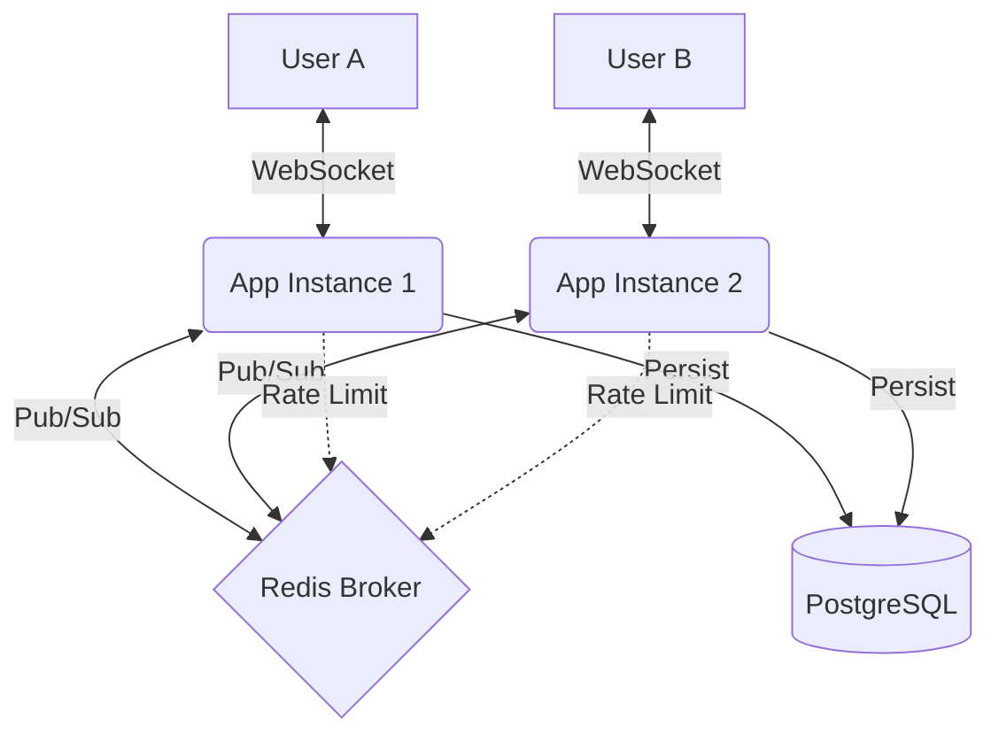

# Chatly — Scalable Real-time Chat Backend

**Chatly** is a high-performance, scalable real-time chat backend built with **Go**. It features horizontal scaling via **Redis Pub/Sub**, production-grade security with **JWT Refresh Token Rotation**, and a robust **Clean Architecture**.

Chatly adalah backend chat *real-time* berperforma tinggi yang dibangun dengan **Go**. Fokus utama project ini adalah pada **Scalability (Horizontal Scaling)**, **Clean Architecture**, dan **Production-grade Security**.

## 🛠️ Tech Stack
- **Language**: Go 1.25+
- **HTTP Framework**: Gin (High-performance web framework)
- **Real-time**: Gorilla WebSocket
- **Persistence**: PostgreSQL
- **Cache & Pub/Sub (Scaling)**: Redis
- **Authentication**: JWT (v5) with **Refresh Token Rotation** & **Reuse Detection**
- **Rate Limiter**: Implementation of Sliding Window algorithm via Redis
- **Deployment**: Docker & Docker Compose (Multi-stage build)

## 📡 System Architecture
Sistem ini menggunakan **Redis Pub/Sub** untuk mensinkronisasi pesan antar instance server, memungkinkan *Horizontal Scaling* secara efisien.



## 🚀 Fitur Utama
- **WebSocket Scaling**: Pesan tersinkronisasi antar banyak instance via Redis.
- **Advanced Auth**: Rotasi token otomatis untuk mencegah pembajakan sesi.
- **Interactive Documentation**: Swagger UI integrated for easy API testing.
- **Demo Frontend**: Simple HTML/JS client included for real-time demo.
- **Unit Tested**: Core logic covered with high-quality unit tests.
- **Rate Limiting**: Melindungi server dari spamming (20 req/menit per IP).
- **Clean Architecture**: Kode terstruktur rapi sehingga mudah di-maintain.
- **Automatic Migrations**: Skema database diperbarui otomatis saat startup dengan *Advisory Lock*.

## 🏗️ Struktur Proyek
- `cmd/main.go`: Entry point & Dependency Injection.
- `internal/domain`: Model data & Interface.
- `internal/repository`: Implementasi akses data (Postgres).
- `internal/service`: Logika bisnis & Unit Tests.
- `internal/delivery`: HTTP Handlers, Routing, & Swagger.
- `static/`: Frontend assets (HTML/CSS/JS).

## ⚙️ Cara Menjalankan

### 1. Prasyarat
- Docker & Docker Compose
- Pastikan Postgres dan Redis Anda yang sudah ada sedang berjalan.

### 2. Jalankan dengan Docker Compose
```bash
docker compose up --build
```

## 🧪 Panduan Testing

### Testing via Swagger
1. Jalankan aplikasi: `docker compose up`
2. Buka [http://localhost:8090/swagger/index.html](http://localhost:8090/swagger/index.html)
3. Anda bisa mencoba semua API (Register, Login, Me) langsung dari sana!

### Testing via Frontend Demo
1. Buka [http://localhost:8090/](http://localhost:8090/) di browser Anda.
2. Login menggunakan kredensial default (`al@chatly.io` / `password123`) atau register user baru.
3. Buka tab baru di browser ke [http://localhost:8091/](http://localhost:8091/) (App 2).
4. Chat antar tab! Pesan akan sinkron secara real-time via Redis Pub/Sub.

### Running Unit Tests
```bash
go test ./internal/service/... -v
```
